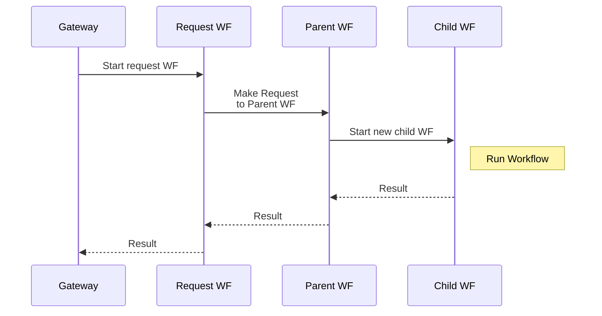
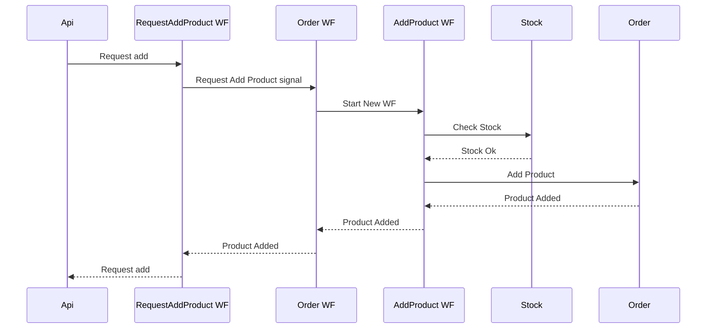

```mermaid 
sequenceDiagram
    Gateway ->> Request WF: Start request WF
    Request WF->>Parent WF: Make Request <br> to Parent WF
    Parent WF->>Child WF: Start new child WF
    Note right of Child WF: Run Workflow
    Child WF-->>Parent WF: Result
    Parent WF -->> Request WF: Result
    Request WF -->> Gateway: Result
```

```mermaid
sequenceDiagram
    Api->>RequestAddProduct WF: Request add
    RequestAddProduct WF->>Order WF: Request Add Product signal
    Order WF->>AddProduct WF: Start New WF
    AddProduct WF->>Stock: Check Stock
    Stock -->> AddProduct WF: Stock Ok
    AddProduct WF ->> Order: Add Product
    Order -->> AddProduct WF: Product Added
    AddProduct WF -->> Order WF: Product Added
    Order WF -->> RequestAddProduct WF: Product Added
    RequestAddProduct WF -->> Api: Request add
```